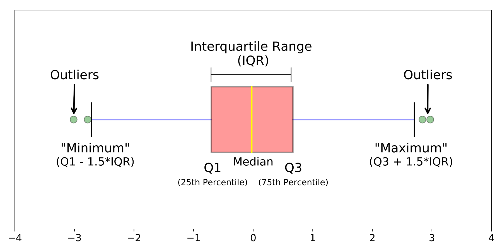

In statistics, exploratory data analysis **(EDA)** is an approach to analyzing data sets to summarize their main characteristics, often with visual methods.

\par Now We will take one example to analyze the data set graphically. Consider information on population, region, area size, infant mortality and others from different countries of the world. All these data sets are made up of data from the US government (https://www.kaggle.com/fernandol/countries-of-the-world). 

#### Reading the csv file that contains the data information and store it in the variable "countries" :

```{r}
countries <- read.csv(file = "countries_world.csv",stringsAsFactors = FALSE)
#dimension of 'countries'
dim(countries)
#structure of 'countries'
str(countries)
```

```{r}
# loading 'dplyr' package
library(dplyr)
```
```{r}
#Omit the rows that contain NA's
new_country_dat <- na.omit(countries)
#Dimension of the new data set
dim(new_country_dat)
```

```{r}
#Top of the data
dim(head(new_country_dat[, c(1:3)]))
#Bottom of the data
tail(new_country_dat[, c(1:3)])
```
```{r}
#select(new_country_dat, Country) %>% unique %>% nrow 
#unique(new_country_dat$Country
```
## Exploratory Graphics

To communicate information clearly and efficiently, data visualization uses statistical graphics, plots, information graphics and other tools. For data visualization we can use the following graphical packages :

* Boxplot
* Barplot
* Histogram
* Scatterplot

### Boxplot

Boxplots are a visual representation of the five-number summary plus a bit more information. In particular, boxplots commonly plot outliers that go beyond the bulk of the data. This is implemented via the ```boxplot()``` function.

**Five-number summary** is a set of descriptive statistics that provide information about a dataset. It consists of the five most important sample percentiles: 

* the sample minimum (smallest observation),
* the lower quartile or first quartile (Q1),
* the median (the middle value),
* the upper quartile or third quartile (Q3),
* the sample maximum (largest observation).

```{r}
#five_number summary
fivenum(new_country_dat$Literacy)
summary(new_country_dat$Literacy)
#standard deviation
sd(new_country_dat$Literacy, na.rm = TRUE)
#interquartile range 
IQR(new_country_dat$Literacy, na.rm = TRUE)
```
```{r fig.align="center", out.width = '50%'}
#Boxplot
boxplot(new_country_dat$Literacy, col="blue")
```

#### Understanding boxplot

```{r pressure, echo=FALSE, fig.cap="Different parts of boxplot", out.width = '50%',fig.align="center"}

```

A boxplot is a standardized way of displaying the distribution of data based on a five number summary (“minimum”, first quartile (Q1), median, third quartile (Q3), and “maximum”). It can tell you about your outliers and what their values are. It gives us a good indication of how the values in the data are spread out.

### Barplot

Barplot is a graph that presents categorical data with rectangular bars with heights or lengths proportional to the values that they represent. The bars can be plotted vertically or horizontally. A vertical bar chart is sometimes called a line graph. The barplot can be made with the ```barplot()``` function.

```{r fig.cap="Example 1: Barplot", out.width = '50%',fig.align="center"}
#Bar plot for birthrate for first 10 countries in the world
#library(tidyr)
subset_barplot_x <- head(c(new_country_dat$Birthrate),5)
subset_barplot_y <- head(c(new_country_dat$Country),5)
barplot(subset_barplot_x, names.arg=subset_barplot_y, main = "countries vs birthrate", col = "blue", border ="red")
```
Thus basic syntax to create a bar-chart in ```R``` is: ```barplot(H,xlab,ylab,main,names.arg,col)```, where 

* **H** : vector or matrix containing numeric values used in bar chart
* **xlab** : label for x-axis 
* **ylab** : label for yaxis
* **main** : title of the bar chart 
* **names.arg** : vector of names appearing under each bar 
* **col** : give colors to the bars in the graph 

#### Stacked Barplot

We can create bar chart with groups of bars and stacks in each bar by using a matrix as
input values.

```{r fig.cap="Example 2: Stacked Barplot", out.width = '50%',fig.align="center"}
#Group barplot
# Create the input vectors.
#library(tidyverse)
subset_stack_barplot <- table(new_country_dat$Birthrate, new_country_dat$Climate)
barplot(subset_stack_barplot, main = "Climate Vs Birthrate", col=c("blue", "red"))
legend("topleft", c("birthdate","Climate"), fill=c("blue","red"), cex=1.3)
```
### Histogram

A histogram is a visual representation of the distribution of a dataset.It is an estimate of the probability distribution of a continuous variable. The histogram can be made with the ```hist()``` function.

```{r fig.cap="Histogram", out.width = '50%',fig.align="center"}
hist(new_country_dat$Deathrate, col ="magenta")
```

### Scatter Plot

A scatter plot is a two-dimensional data visualization that uses dots to represent the values obtained for two different variables - one plotted along the x-axis and the other plotted along the y-axis. A scatter plot can be created using the function ```plot()```.

```{r}
x <- new_country_dat$Deathrate
y <- new_country_dat$Birthrate
# Plot with main and axis titles
plot(x, y, main = "Birthrate vs Deathrate",
     xlab = "Birthrate", ylab = "Deathrate",
      frame = FALSE)
# Add regression line
plot(x, y, frame = FALSE)
abline(lm(y ~ x, data = new_country_dat), col = "blue")
```

## ggplot2

ggplot2 is a data visualization package for the statistical programming language ```R```.

### Understanding ```ggplot``` syntax:

```ggplot``` works with dataframes and not individual vectors. All the data needed to make the plot is typically be contained within the dataframe supplied to the ```ggplot()``` itself or can be supplied to respective geoms. Let’s initialize a basic ```ggplot```.

```{r}
library(tidyverse)
library(ggplot2)
```

```{r out.width = '50%',fig.align="center"}
ggplot(new_country_dat, aes(x = Birthrate)) # Birthrate is a column in 'new_country_dat'
```

A blank ```ggplot``` is drawn. Even though the ```x``` and ````y``` are specified, there are no points in it. This is because, ```ggplot``` doesn’t assume that you meant a scatterplot or a line chart to be drawn. Here we have specified what dataset to use and what columns should be used for ```X``` and ```Y``` axis and we did not explicitly asked it to draw any points.

Also note that ```aes()``` function is used to specify the ```X``` and ```Y``` axes. 

The ```aes``` argument stands for aesthetics. ```ggplot2``` considers the X and Y axis of the plot to be aesthetics as well, along with color, size, shape, fill etc. If you want to have the color, size etc fixed, you need to specify it outside the ```aes()```, like this:

```{r out.width = '50%',fig.align="center"}
#ggplot(new_country_dat, aes(x=Birthrate), color="steelblue")
```

### Layers:

The layers in ```ggplot2``` are also called *‘geoms’*. Once the base setup is done, you can append the geoms one on top of the other. Following are some of the available list of *geoms*

* **```geom_point()```**,
* **```geom_smooth()```**,
* **```geom_histogram()```**,
* **```geom_boxplot()```**,
* **```geom_bar()```** etc.

### Scatter Plot

We can plot scatter plot using a geom layer called **```geom_point```**. For example, 

```{r fig.cap="Scatter plot", out.width = '50%',fig.align="center"}
ggplot(new_country_dat, aes(x=Area, y = Birthrate)) + geom_point()
```

Now we add a smoothing layer using **```geom_smooth```** 

```{r  out.width = '50%',fig.align="center"}
ggplot(new_country_dat, aes(x=Area, y=Birthrate)) + 
  geom_point(aes(col=Region), size=3) +  # Set color to vary based on state categories.
  geom_smooth(method="lm") +
  coord_cartesian(xlim=c(100, 50000), ylim=c(0, 100)) + 
  labs(title="Area Vs Birthrate", y="Birthrate", x="Area", caption="World countries dataset")
```
where ```lm``` represents linear model and it draws the line of best fit.

#### **```geom_histogram()```**

Histograms (**```geom_histogram()```**) display the counts with bars.

```{r fig.cap="Histogram", out.width = '50%',fig.align="center"}
ggplot(new_country_dat, aes(x = Birthrate)) + geom_histogram( binwidth = 5, fill = "magenta", color = "blue")
```

```{r out.width = '50%',fig.align="center"}
library(grid)
library(gridExtra)
```

```{r out.width = '50%',fig.align="center"}
ggplot(new_country_dat, aes(x=Pop_Density, y = Birthrate)) + geom_point(size = 1.5,colour='magenta')+geom_line()+stat_smooth()+theme_bw()+coord_cartesian(xlim=c(0, 500), ylim=c(0, 70))->g1

ggplot(new_country_dat, aes(x=Pop_Density, y = Deathrate)) + geom_point(size = 1.5,colour='orange')+geom_line(size=1,alpha=0.7,linetype=2)+stat_smooth()+theme_bw()+coord_cartesian(xlim=c(0, 500), ylim=c(0, 70))->g2
grid.arrange(g1, g2, ncol = 2)
```

#### **```geom_boxplot()```**

```{r out.width = '100%',fig.align="center"}
new_country_dat_subset <- head(new_country_dat,5)
ggplot(new_country_dat_subset, aes(x=Region,y= Literacy))+geom_boxplot(aes(fill= Region)) +theme_bw()+coord_cartesian(ylim=c(0, 100))+theme(axis.text.x = element_text(angle = 90,hjust=1))
```